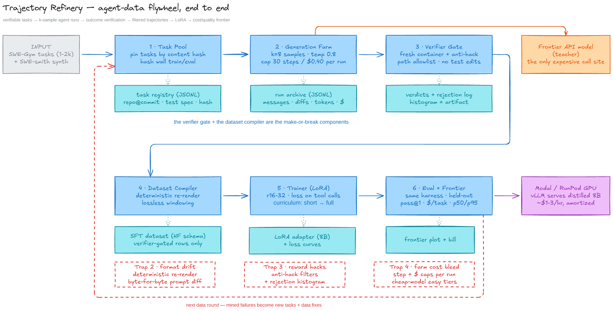

# Refinery

**Verified agent trajectories in → a small distilled model out.**

This repo is the flagship project: the production **trace → small-model flywheel** that every AI
company claims as its moat, built end to end with numbers. The pipeline is the contribution — the
LoRA/weights are the proof it works.

```
verifiable tasks → agent runs (k samples/task) → outcome verification →
filtered trajectories → SFT dataset → small student → same eval harness →
cost/quality frontier vs the teacher
```

---

## The task

**Complex legal verification.** Given a legal claim and a hidden set of atomic propositions from a
judgment scraped from [livelaw.in](https://www.livelaw.in), decide whether the retrieved
propositions entail the claim.

```bash
python -m refinery.cli --config configs/legal.json taskpool   # 123 tasks over 123 propositions
python -m refinery.cli --config configs/legal.json farm --teacher api
python -m refinery.cli --config configs/legal.json verify --fresh
python -m refinery.cli --config configs/legal.json compile --strategies windowed,full_context
python -m refinery.cli --config configs/legal.json train --name student
python -m refinery.cli --config configs/legal.json eval --contenders teacher,student,heuristic
python -m refinery.cli --config configs/legal.json report
```

The `entailed` verdict is exactly the output the upstream
[`para-proposition`](https://github.com/mohar-xe/para-proposition) pipeline does **not** produce —
its README says stage 1 emits facts and stops. Premises are human-checked propositions; negatives are
entity swaps (wrong court, year, party, amount) that leave ~95% of tokens intact, which is what
defeats lexical matching. See [`LLD.md`](LLD.md) D-025/D-026.

## Results — legal scale (pending first full run)

> Nothing is claimed here until it has been measured. This table is the README's first screen
> because the numbers are the deliverable; it is filled from `reports/` by the pipeline, never by hand.

| Contender | Params | pass@1 (eval, held-out) | Valid tool calls | Cost / resolved task | p50 latency |
|---|---|---|---|---|---|
| Teacher `stealth/space-bunny-alpha` | API | _pending_ | _pending_ | $0.00 (free tier) | _pending_ |
| **Refinery student (this repo)** | 0.92M non-emb | _pending_ | _pending_ | ~$0.00 (CPU) | _pending_ |
| Majority-vote baseline | — | _pending_ | n/a | $0.00 | _pending_ |

Supporting numbers, all generated into `reports/`:

| Artifact | What it answers |
|---|---|
| `reports/frontier.md` + `.png` | pass@1 vs cost, and pass@1 vs latency |
| `reports/rejection_histogram.md` | what verification caught, by reason code |
| `reports/windowing_ablation.md` | full-context vs windowed vs naive-truncated |
| `reports/curriculum_ablation.md` | short-first curriculum vs mixed-from-scratch |
| `reports/bill.md` | the ledger: requests, tokens, wall-time, waste per verified trajectory |

---

## Architecture



Six stages, all resumable, all scale-configured:

| # | Stage | Module | Its job |
|---|---|---|---|
| 1 | Task pool | `refinery/taskpool/legal.py` | real tasks, content-hash pinned, hard hash wall between train/eval |
| 2 | Generation farm | `refinery/farm/` | k samples/task against a teacher, hard caps, full JSONL trace per run |
| 3 | Verifier gate | `refinery/verifier/` | independent check + anti-hack filters, one reason code per rejection |
| 4 | Dataset compiler | `refinery/compiler/` | deterministic re-render, lossless windowing, loss masks |
| 5 | Trainer | `refinery/trainer/` | curriculum, loss on assistant/tool-call tokens only |
| 6 | Eval + frontier | `evalkit/` | identical harness for all contenders, cost/quality frontier |

Task sources, all behind `--source`: `legal` (active) · `snli` (textual entailment, the original
pool) · `url` (URL reconstruction from a damaged string, measured then superseded).

Design docs: [`HLD.md`](HLD.md) (what it is) · [`LLD.md`](LLD.md) (**what I chose and why** —
every substitution, every reversal, and every bug that was silent) ·
[`SPEC.md`](SPEC.md) (project spec and reading stack)

---

## Honest failure paragraph (updated)

**What is already broken or weak:** the corpus is three judgments and 123 propositions — the
scraper reaches 40+ categories, so this is a floor rather than the intended scale, but no claim is
made at scale yet. Labels are generated by documented transforms, and while each task records the
transform *actually applied* so any label can be audited by reading one field, human-checked labels
exist only for the upstream's propositions, not for these claims. The teacher that produced the
current dataset is the offline heuristic, not a model: its error profile is a *parameter chosen to
exercise the verifier*, not a measurement, and the frontier comparison needs the real API teacher
before any cost/quality claim can be made. The student is ~0.9M non-embedding parameters trained
from scratch, so this cannot claim LoRA distillation works — only that verified-trajectory SFT
transfers to a very small model. And the windowing policy is a measured **no-op on this corpus**:
legal propositions average ~55 characters, below the digest envelope, so `windowed` and
`full_context` compile to identical bytes. That null result is reported rather than tuned away.

## Previous failure paragraph (v0.1, generic-NLI run)

*Written before the run, updated after it. Kept first-class because a results table without a
failure paragraph is marketing.*

**What is already broken or weak at toy scale:** the verifier is a label-equality check, which is a
much weaker trust boundary than a pytest suite in a fresh container — the "14% of passing
trajectories were reward hacks" story is therefore *understated*, not proven, unless the adversarial
task generator produces real traps. The teacher is a free model, so the flagship's most persuasive
artifact (the dollar bill) is `$0.00`, and we substitute request/token/throughput accounting for it.
The student is 0.92M non-embedding parameters trained from scratch, which means we **cannot** claim
LoRA distillation works — only that verified-trajectory SFT transfers to a very small model. See
`LLD.md §1` for the full substitution table.

---

## Quickstart

```bash
./scripts/setup.sh          # provisions the uv venv (torch CPU wheels) + data
export OPENROUTER_API_KEY=… # teacher key; free tier is fine
./scripts/run_toy.sh        # stages 1-6 end to end, writes reports/
```

Stages 1–4 need no GPU and no torch. Stage 5 (trainer) runs on CPU in minutes at this scale.
See [`CONTRIBUTING.md`](CONTRIBUTING.md) for the commit and branch conventions.

## Scale

`configs/toy.json` is what ships. `configs/full.json` is the same code at the flagship's scale
(SWE-Gym tasks, containerized verification, LoRA on an 8B base). The pipeline contains no
`if toy:` branches — that is the point, and `LLD.md D-001` explains why it matters.

## License

MIT — see [`LICENSE`](LICENSE).
